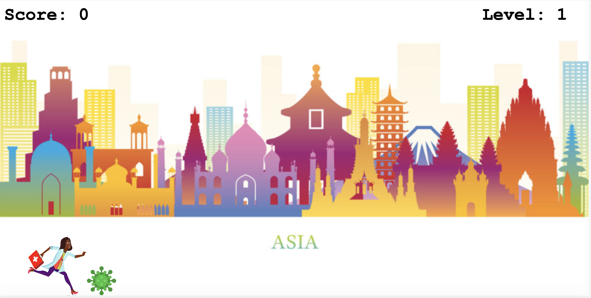

# Corona Run Game

Project build for #hackforheroes, a two days and a half hackathon organized by Makers. The main theme was developing an app inspired by the Covid-19 crisis.



### Contributors 

- [Kuba Jawor](https://github.com/plkujaw)
- [Shubinder Virk](https://github.com/SHUBV92)
- [Jara Santamaria Martinez](https://github.com/jarasmar)

### The Game

The main idea was building a game to make the lockdown time pass a bit faster while tributing our key workers. The first day we agreed the global mantra for this pandemic is **'We are all in this together'** so making the game inclussive was our goal. Our character is a doctor of gender and skin tone of our choice, that runs around the world fighting the virus.

**How it works:**

- We start by choosing our player, selecting gender and skin tone.
- By clicking Start Game we will see our player and the game canvas.
- Our player can jump (press space or up arrow) to avoid the virus that come towards him/her.
- Every virus successfully avoided will add a point to our score.
- Every 6 points in our score will make the game level up.
- When we change level, we get a new continent as a background and virus start coming faster.
- After Game Over we can click on Play Again and start over.


### Getting Started

Clone the repo and navigate to the project root directory:

```
$ git clone https://github.com/jarasmar/hfh_corona_game
$ cd hfh_corona_game
```

Run the project from the terminal:
```
$ brew install http-server
$ http-server
visit http://localhost:8080/
```

### Extra features
The time was very tight in the hackathon, and although we managed to get all the features in our MVP these are some other we had in mind: 

- Option to choose different key workers (doctor, nurse, driver, fire fighter...)
- Wider range of genders and skin tones
- Music effects (half way implemented)
- Crouch move to avoid flying virus
- Preview of the character in the selection screen
